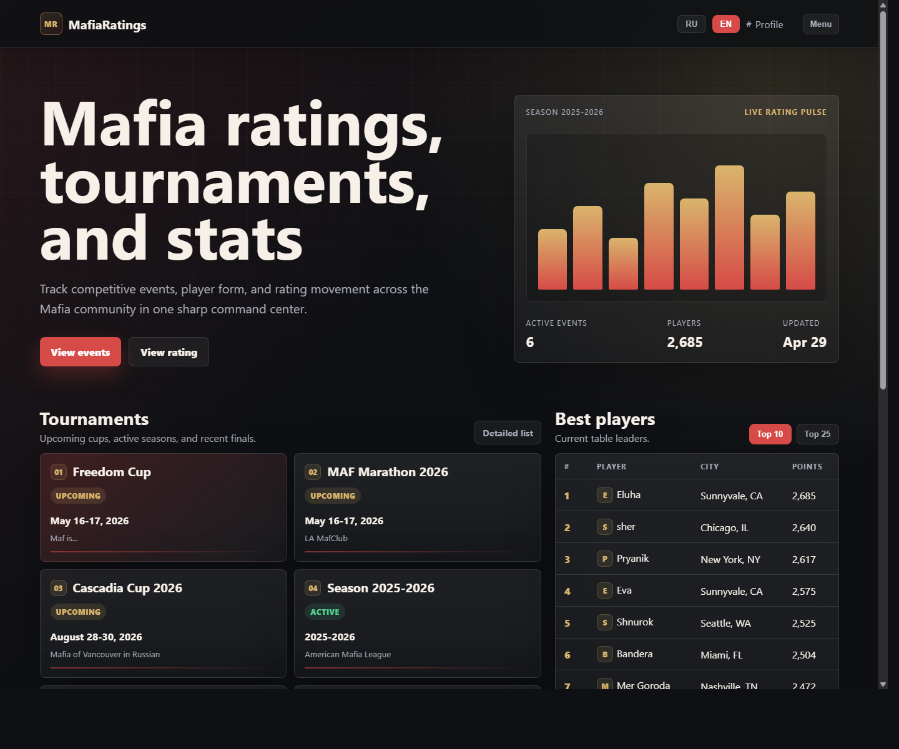
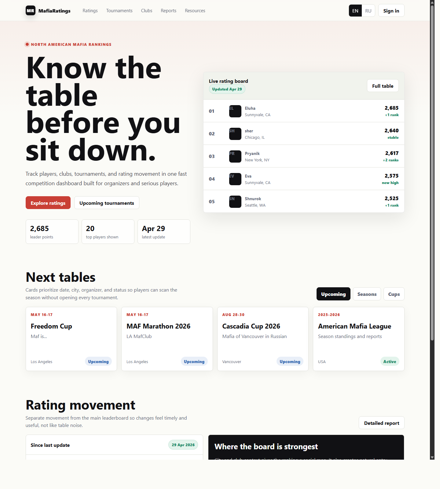
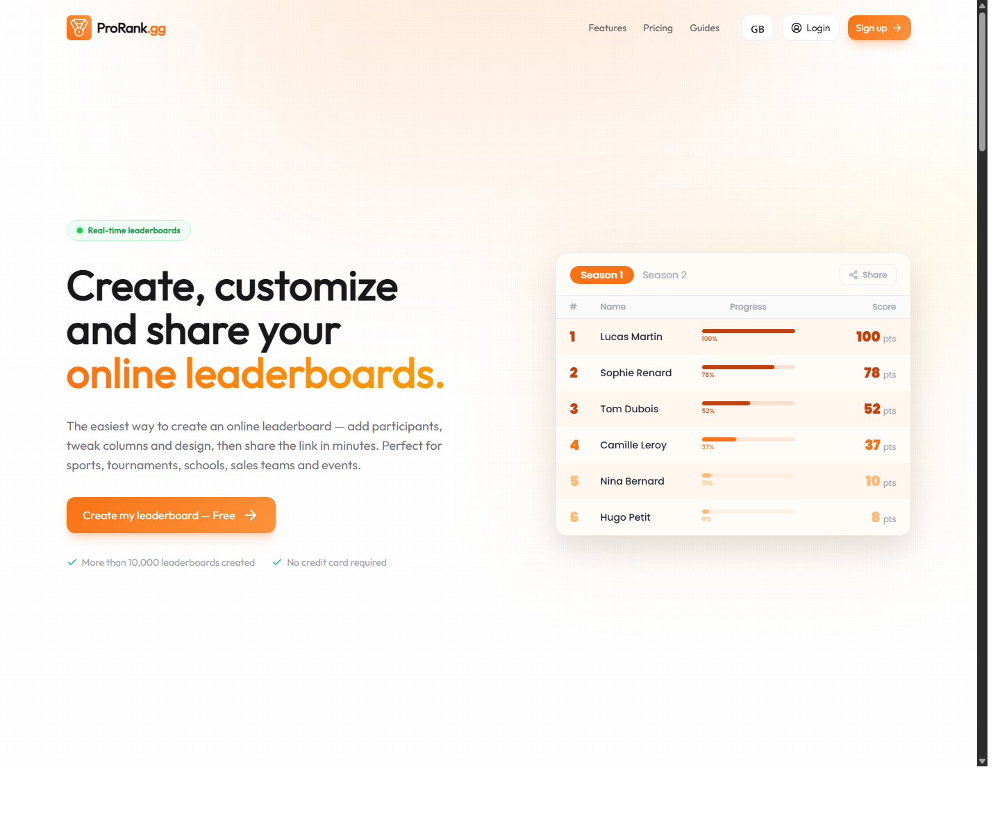
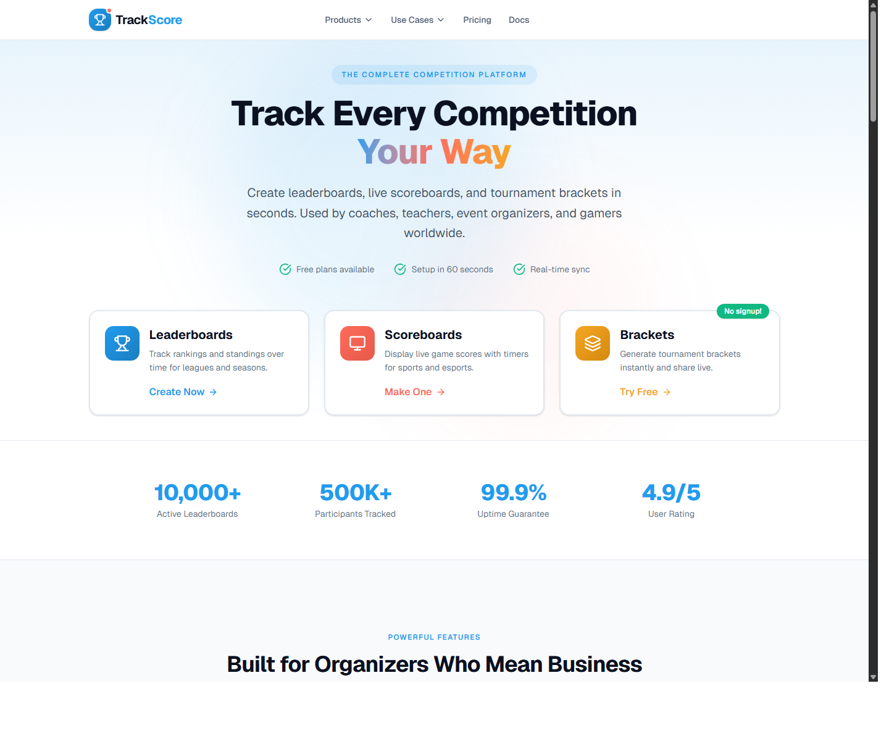
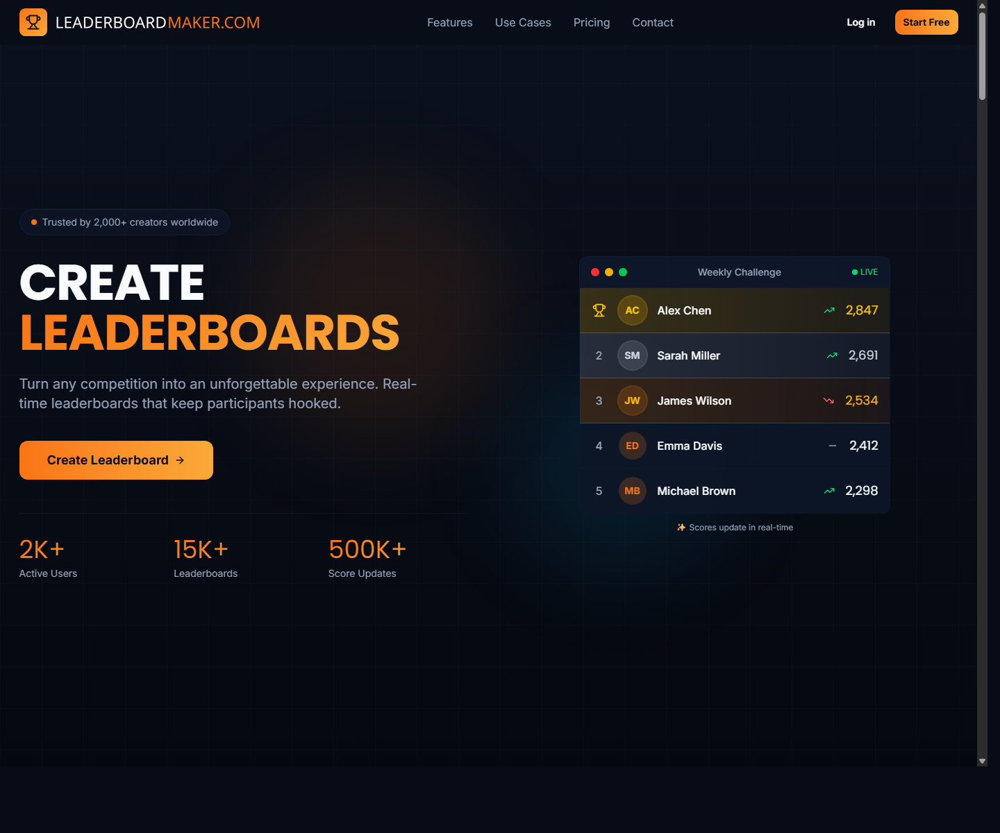

# Design Improvement: MafiaRatings Homepage

## TL;DR
Turn the homepage into a competition command center: a strong leaderboard hero, compact event cards, and a separate rating-movement module. The current page has the right data, but the visual hierarchy makes everything feel equally important.

## Current State


The current homepage is functional and already focused on tournaments, rating changes, and top players. The redesign keeps that data model, but changes the first impression from "static list page" to "live ranking product."

## New Concept
[Open the modern concept](mafiaratings-modern-concept.html)



## Improvement Ideas

### 1. Make the leaderboard the hero
Lead with the product's most valuable asset: the ranking table. The new concept puts a live rating board next to the headline, so visitors understand the site in one glance.

Inspired by:

ProRank uses the idea of ranking as the primary object of the product, not a secondary table. Source: https://www.prorank.gg/

Why this works: MafiaRatings is fundamentally a trust and status product. Showing the top board immediately makes the homepage feel current, useful, and specific.

Sketch:
```text
+----------------------+  +---------------------------+
| Know the table...    |  | Live rating board         |
| Short value copy     |  | #1 Player      2,685      |
| [Ratings] [Events]   |  | #2 Player      2,640      |
| stat stat stat       |  | #3 Player      2,617      |
+----------------------+  +---------------------------+
```

### 2. Separate events from rating movement
Keep tournaments as a clean card grid, then give rating changes their own section. This prevents upcoming events, recent changes, and top players from competing in one cramped layout.

Inspired by:

TrackScore's competition surfaces separate event tracking from result data so users can scan the part they came for. Source: https://trackscore.online/

Why this works: tournament browsing and rating analysis are different tasks. Splitting them makes both faster.

### 3. Add a local-scene signal
The current data already contains cities. The concept turns that into a "where the board is strongest" panel, making the rankings feel more human and community-based.

Inspired by:

Leaderboard products often create motivation by making status and participation visible. Source: https://leaderboardmaker.com/

Why this works: Mafia is social. City and club context gives players another reason to explore beyond the top 10.

### 4. Modernize the visual system without losing density
Use a lighter editorial sports style: off-white canvas, sharp 8px cards, strong typography, red/green semantic motion, and tabular numbers. Avoid decorative cards inside cards and keep the interface scan-first.

Why this works: the site needs to feel credible and fast, not like a landing page detached from the product.

## What's Working
- The homepage already knows the right content groups: tournaments, top players, and rating changes.
- Rows and cards are mostly clickable, which is good for exploration.
- The existing bilingual direction is useful and should be preserved after fixing the encoding issue in checked-in HTML.
- Status badges for events are valuable; they just need stronger hierarchy and cleaner placement.

## All References
- `references/current.png` - current MafiaRatings local homepage capture.
- `references/modern-concept.png` - rendered screenshot of the new concept.
- `references/prorank.png` - ranking-first product reference.
- `references/trackscore.png` - tournament and event-tracking reference.
- `references/leaderboardmaker.png` - leaderboard product reference.
